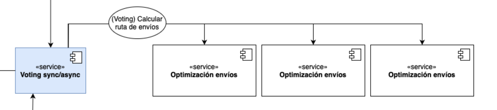

# Descripción

Busca probar si la táctica elegida favorece el ASR-01 de disponibilidad:

> *Cómo transportador, cuando consulto mis rutas de entrega, dado que el algoritmo de rutas de entrega opera en condiciones normales, quiero obtener la ruta más óptima de forma correcta. Esto debe suceder en menos de 5 segundos.*


Se aplica la táctica de voting para segurarse que el cálculo de las rutas



***Optimizacion Envios fue implementado en:***
- C
- Python
- NodeJS

## Táctica Voting

El componente de votación detectará y enmascará
- Errores en el cálculo del algoritmo de envíos
- Indisponibilidad en los algoritmos
  - Algoritmos que tomen más de 5 segundos en responder se considerarán indisponibles
  - Algoritmos que nunca respondan o se encuentren caídos

  # Correr el experimento


***Pre-requisites***
  - Tener docker y docker-compose instalados
  - Tener NodeJS versión 20 instalado

---

***Correr el experimento en local***

1. Una vez en la raiz del experimento, correr el comando
  ```
    npm install
  ```

  Seguido del comando 
  ```
    sudo ./build.sh
  ```
 
  Esto levantará los componentes en contenedores de docker e instalará las dependencias necesarias para poder correr el experimento (que se encuentra implementado en NodeJS)

  2. Una vez que el proceso de instalación y levantamiendo de los componentes (voting y optimizacion de envios) hayan terminado, se debe correr el experimento

  ```
    node experiment.js
  ```

  Este hará alrededor de 300 llamadas en un rango de tiempo de 3mins. Al final generará un respoder en HTML con los resultados.

  El reporte debe aparecer con el nombre de report.html
  
  ***Correr el experimento usando componentes desplegados***

  1. Una vez en la raiz del experimento, correr el comando
  ```
    npm install
  ```
  Esto instalará todas las dependencias necesarias para correr el experimento

  2. Cuando todas las dependencias de NodeJS estén instaladas, es momento de correr el experimento pasando cómo parámetro la del componente voting desplegado en Heroku   
  
  ```
    ENVIOS_API=https://voting-arquitectura-3f8603cc8c5b.herokuapp.com node experiment.js
  ```
